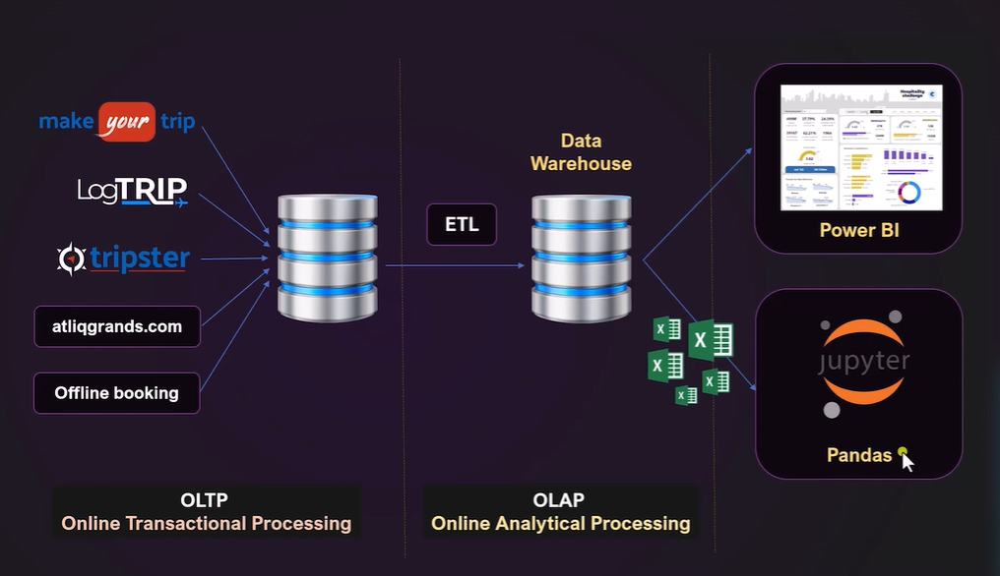

# 📊 Data Analysis of Boulevard Hotels using Pandas Library

An in-depth 'Data Analysis' project of ‘Boulevard Hotels Ltd.’ to understand its business market, its position. Also to help the company regain their market share and revenue across Germany.

### ✅ Project Details:

- Client – Boulevard Hotels Ltd, Germany (Bavaria) 
- Segment – Hospitality Domain
- Unit Location - Berlin, Munich, Nuremberg, Heidelberg

### ✅ Problem statement:

‘Boulevard Hotels’ is a 5 Star luxury hotel based in Bavaria, Germany. They own multiple five-star hotels across Berlin, Munich, Heidelberg, and Nuremberg. They have been in the hospitality industry for the past 11 years. 
In recent times, due to strategic moves by other competitors and ineffective decision-making by management, ‘Boulevard Hotels’ are losing market share and revenue in the luxury hotels category. 
As a strategic move, the management of ‘Boulevard Hotels’ wants to onboard a Business Data Analyst to incorporate “Business and Data Intelligence” to regain their market share and revenue.

### ✅ Data sources: 
The company’s Booking Database is the main data source and stores all records & vital documents. Data Engineers joined our team to help build an ETL pipeline to extract and transfer the required data to a different secure Data Warehouse. From there, they generated CSV files filled with up-to-date data.

💡Process Used: OLTP & OLAP

-	Records extracted: 1,34,591 rows of records

### ✅ Process of Data Gathering: 

1.	Understanding the business requirements and framing the right business questions that will lead to better insight generation
2.	Collected the required data from the Organisation's Databases – from SQL server, Excel records, data warehouse, etc. Data Engineers provided all the necessary data and converted it to CSV files.
3.	Imported those CSV files to Jupyter Notebook for further Transformation and analysis.
4.	Performed extraction, ‘Data Modelling’, transformation, removed anomalies, and cleaned using libraries like Pandas in Python.
5.	Refined the datasets with cleaned & transformed data

### 💡Key Learnings:

1.	Understanding Business Problems
2.	Data Understanding and Collection:
- Loaded the required datasets into the notebook using ‘pd.read_csv’
- Got detailed understanding of the data using ‘df_describe(), info(), value_counts(), unique(), shape(), etc.
3. Data Cleaning & Exploration (EDA):
- The bookings_dataset contained (-ve) & extreme values that were corrected using ‘abs()’ absolute values
- One anomalous booking () was dropped
- Five extreme records were removed as outliers.
- Used techniques like groupby(), replace(), drop(), isnull(), loc()
4. Data Transformation:
-	Used techniques like merge(), abs(), sum(),
-	Created ‘Occupancy Percentage’ column to calculate successful bookings and expressed as a percentage for easy comparison across rooms, properties, and cities.
5. Generating Insights using ‘Matplotlib’- plot(), bar, pie chart, etc.

## Author & Contact
👩‍💻 Author: Pragyan Saikia

📧 Email: [pragyan.saikia04@gmail.com]

